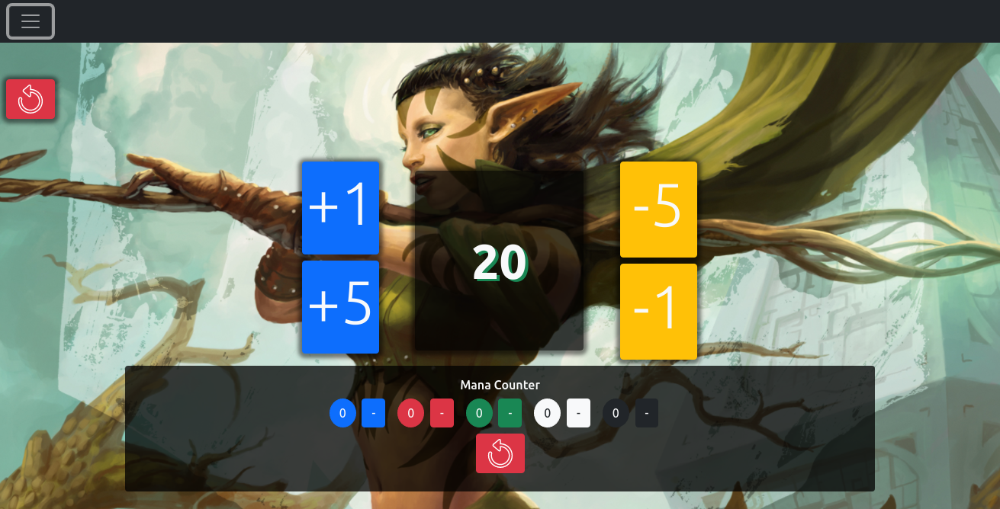
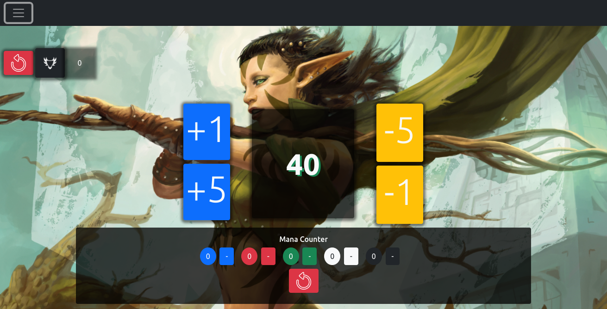
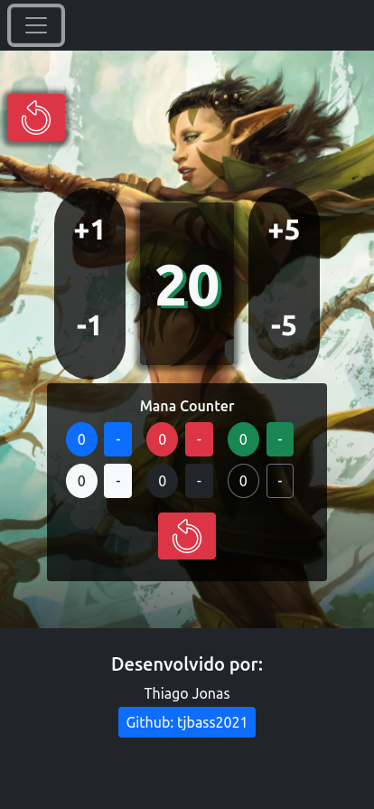
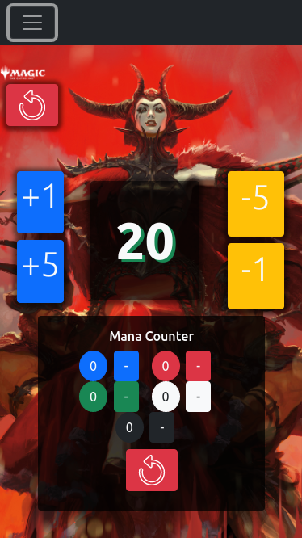
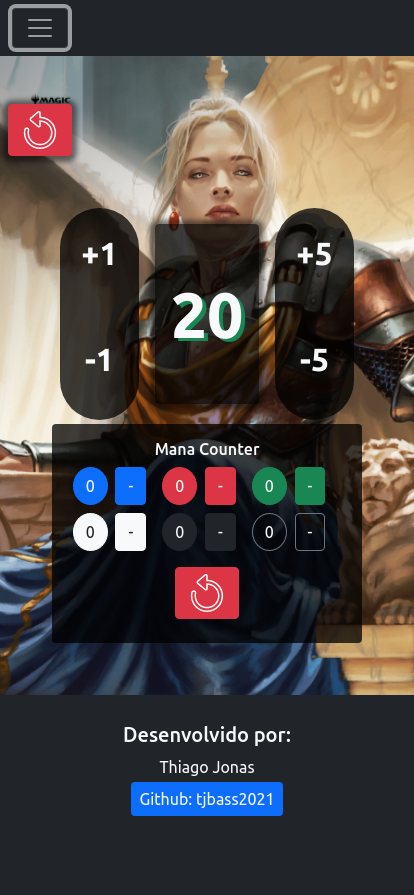
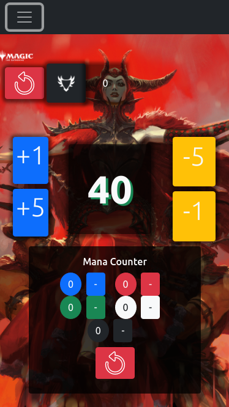
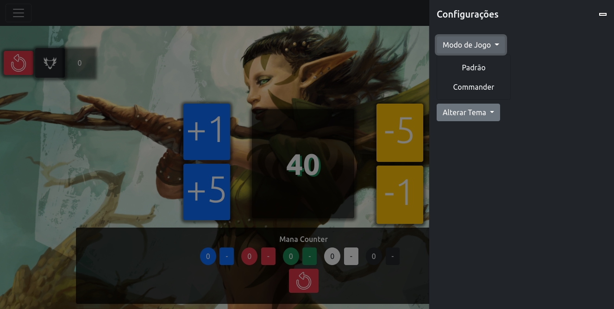
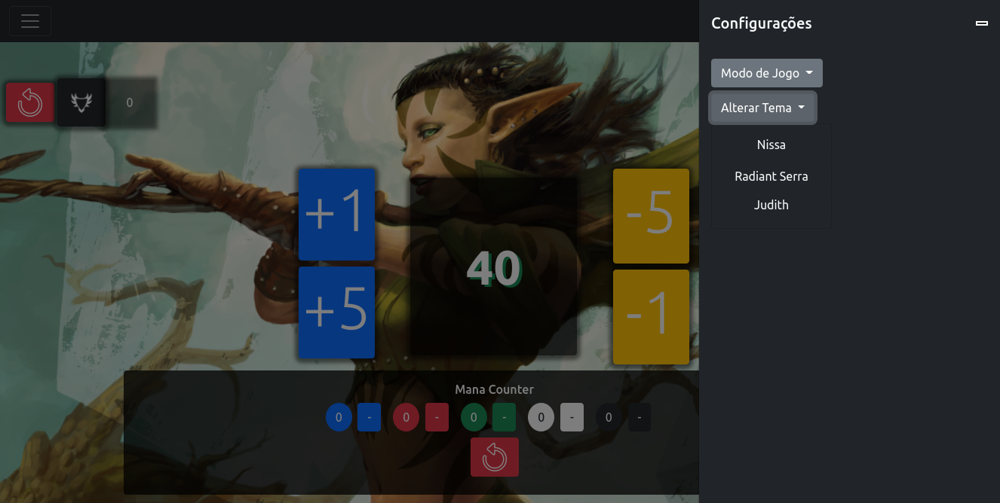

# MTG Counter with Mana Counter and Commander format
---

## O Projeto

Trata-se de um projeto simples de um contador de pontos de MTG com poucas funcionalidades e apenas duas modalidades de jogo: Formato Padrão e Commander.

Inteiramente escrito com o uso do framework Bootstrap e a biblioteca JQuery, que, como de conhecimento comum dos devs, trabalham em conjunto.

Todas as funções para a manipulação do DOM foram chamadas em uma tag script.

Além do uso dos estilos de Bootstrap, também foi criado um estilo próprio para personalização do projeto.

Graças a magia do FlexBox, o projeto é responsivo, mas ainda necessitando de alguns retoques quanto ao redimencionamento de alguns botões para ficarem uniformes, o que será feito em breve.

## Prints do projeto

### Versão para desktop
---

(versão padrão)

(versão commander)

### Responsividade formato Padrão

    
    
    

### Responsividade formato Commander

  

---

## Selecionando o modo de jogo

---

## Selecionando o Tema

---

## Considerações

O projeto ainda não está concluído e ainda há bastante a ser feito, outras configurações a serem implementadas. Aceito dicas, inclusive!

Obrigado pela atenção!

Att,

Thiago Jonas

